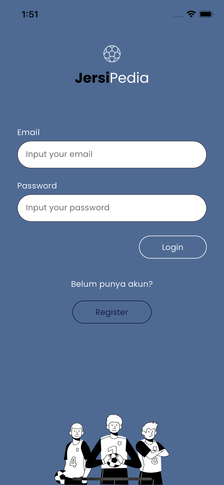
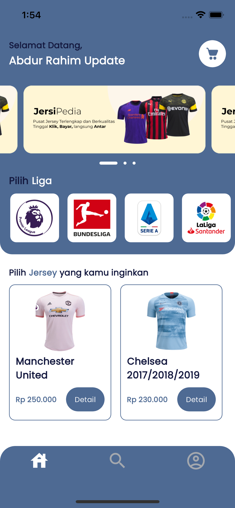
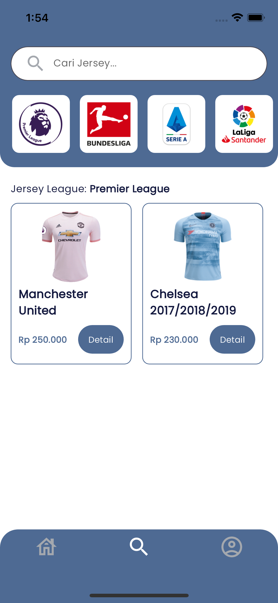
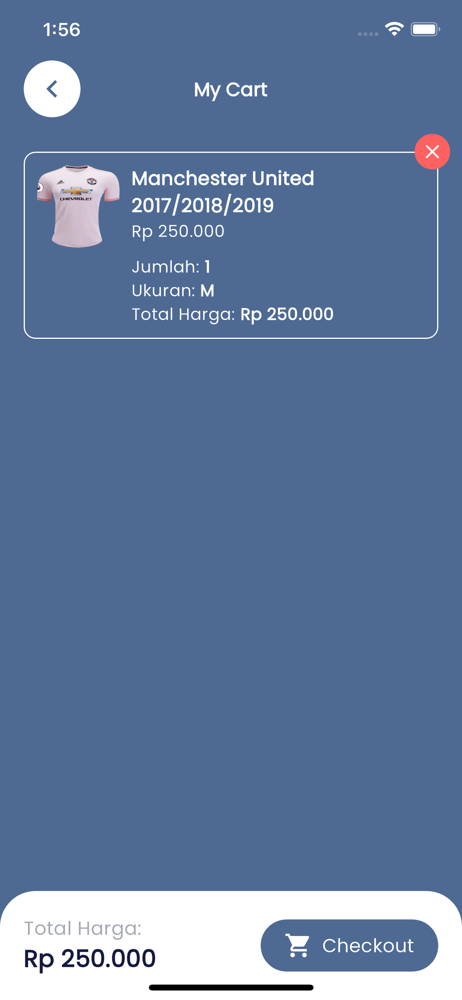
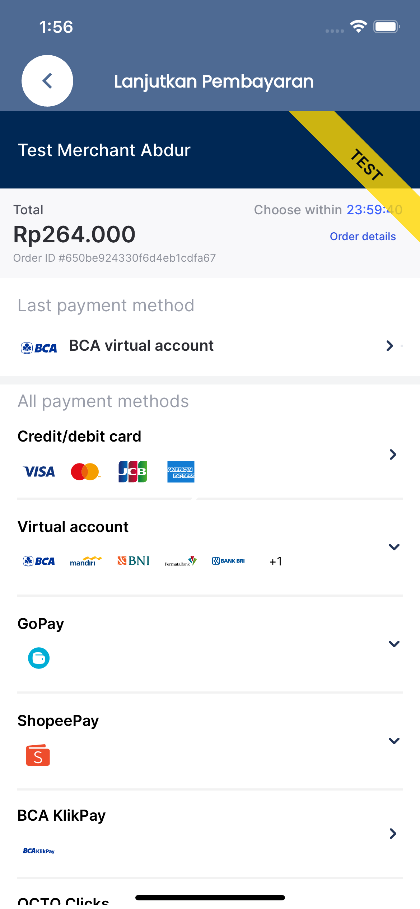

# JersiPedia

## Screenshots

<table>
  <tr>
    <td>Login</td>
    <td>Home</td>
    <td>Search</td>
    <td>Cart</td>
    <td>Payment</td>
  </tr>
  <tr>
    <td></td>
    <td></td>
    <td></td>
    <td></td>
    <td></td>
  </tr>
 </table>

## Video

<video width="315" height="723" controls>
  <source src="assets/files/recording.mov" type="video/mp4">
</video>

## Design

https://www.figma.com/file/jzcWvChHNuNELvZkCZbqhS/JersiPedia-New-Design?type=design&t=tPqr9bqKDdWX4Cl5-1

## Backend

https://github.com/abdoerrahiem/jersipedia_api_nodejs

## API Documentation

- https://documenter.getpostman.com/view/9048970/2s9YCARqeY
- https://github.com/abdoerrahiem/jersipedia-flutter/blob/main/assets/files/JersiPedia%20API.postman_collection.json

## APK Release

https://github.com/abdoerrahiem/jersipedia-flutter/tree/main/release/app-release.apk
